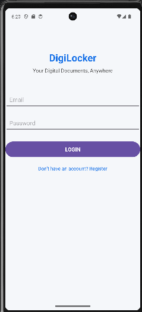
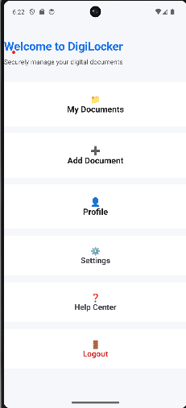
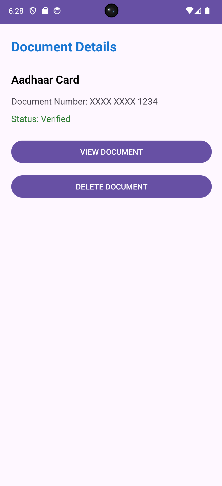
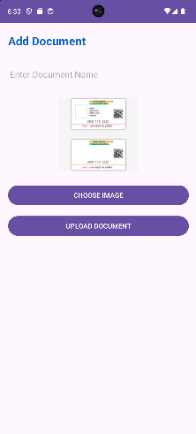

# 📱 DigiLocker Android App

A simple **DigiLocker Android Application** developed using **Kotlin** in **Android Studio** for the **Mobile Application Development (MAD)** subject.

---

## 🎯 Aim

To develop a DigiLocker application that allows users to digitally store and manage important personal documents through a simple and user-friendly Android application.

---

## 📖 Project Overview

DigiLocker is an Android application where users can keep their important documents in one place. Users can view document details, upload document images, and manage documents easily using a clean interface.

---

## ✨ Features

- 👤 User Registration
- 🏠 Home Dashboard
- 📄 My Documents Screen
- 🪪 View Aadhaar Card Details
- 💳 View PAN Card Details
- 🚗 View Driving Licence Details
- 🎓 View Certificates
- ➕ Add New Document
- 🖼️ Upload and Preview Document Image
- 👤 Profile Screen
- 📱 Simple and Minimal User Interface

---

## 🛠️ Technologies Used

- Kotlin
- Android Studio
- XML Layout
- ConstraintLayout
- CardView
- Material Design Components
- Intent Navigation

---

## 📂 Project Structure

```text
DIgiLocker/
│── app/
│   ├── src/
│   │   ├── main/
│   │   │   ├── java/com/example/digilocker/
│   │   │   │   ├── MainActivity.kt
│   │   │   │   ├── RegisterActivity.kt
│   │   │   │   ├── HomeActivity.kt
│   │   │   │   ├── DocumentsActivity.kt
│   │   │   │   ├── DocumentDetailsActivity.kt
│   │   │   │   ├── AddDocumentActivity.kt
│   │   │   │   └── ProfileActivity.kt
│   │   │   ├── res/
│   │   │   │   ├── layout/
│   │   │   │   ├── drawable/
│   │   │   │   └── mipmap/
│   │   │   └── AndroidManifest.xml
│── screenshots/
│── README.md
```

---

## 📱 Application Screens

| Screen | Description |
|--------|-------------|
| Register Screen | User registration page. |
| Home Screen | Main dashboard of DigiLocker. |
| My Documents | Displays available documents. |
| Document Details | Shows document information and status. |
| Add Document | Upload a new document with image preview. |
| Profile Screen | Displays user profile information. |

---

# 📸 Output Screenshots

> Create a folder named **screenshots** in your GitHub repository and upload all screenshots inside it.

## 1️⃣ Register Screen

<p align="center">
  
</p>

---

## 2️⃣ Home Screen

<p align="center">
  
</p>

---

## 3️⃣ My Documents Screen

<p align="center">
  
</p>

---

## 4️⃣ Document Details Screen

<p align="center">
  
</p>

---

## 5️⃣ Add Document Screen

<p align="center">
  
</p>

---

## 6️⃣ Profile Screen

<p align="center">
  
</p>

---

## 🚀 How to Run the Project

1. Open Android Studio.
2. Open the **DIgiLocker** project.
3. Build the project.
4. Run the application on an Android Emulator or a physical Android device.

---

## 🎓 Learning Outcome

- Design Android UI using XML.
- Create multiple activities using Kotlin.
- Navigate between activities using Intents.
- Display and manage document information.
- Upload and preview document images.
- Build a simple document management application.

---

## 👩‍💻 Author

**Name:** Heli Vyas

**Subject:** Mobile Application Development (MAD)

**Project:** DigiLocker Android Application
